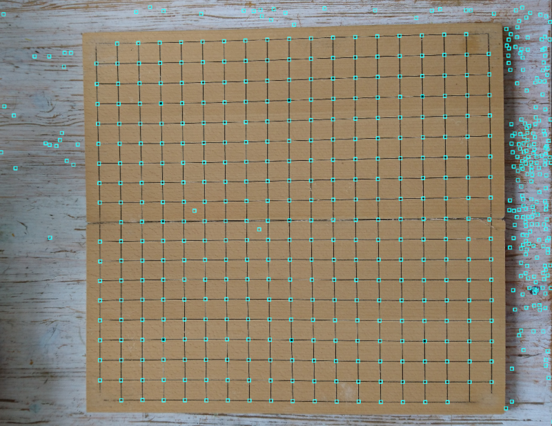
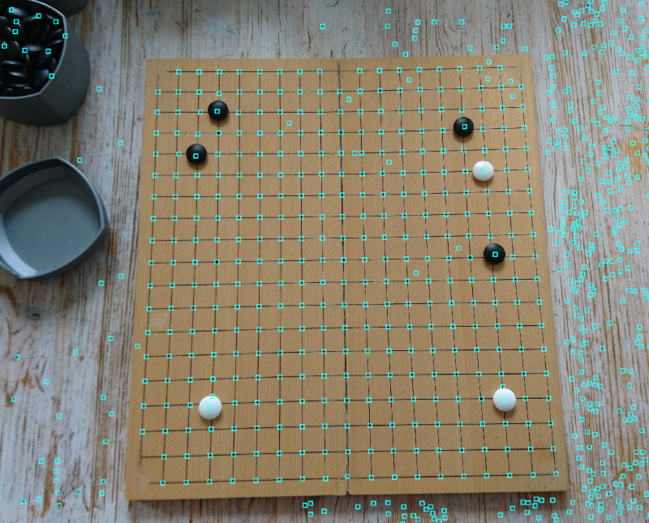
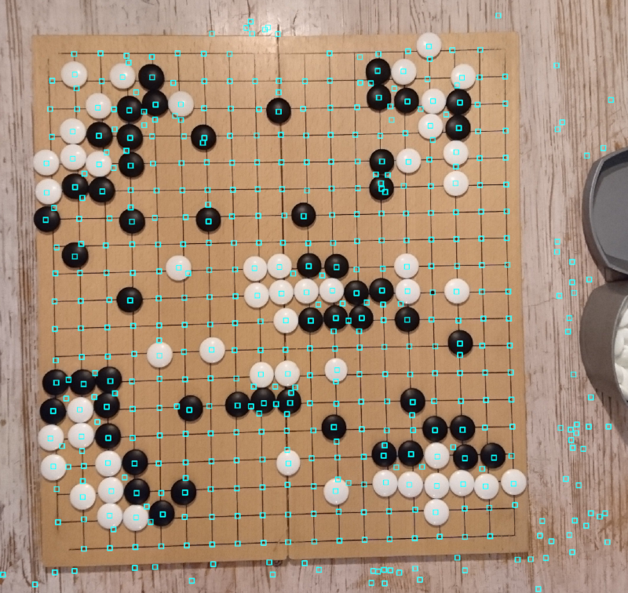

# goban-poc

Incomplete go board detection algorithm from my university days ported to use current opencv in python (originally written in C++).

Candidate stone locations are detected but currently it is missing uniform grid detection from the candidate point cloud.

## Some output examples

